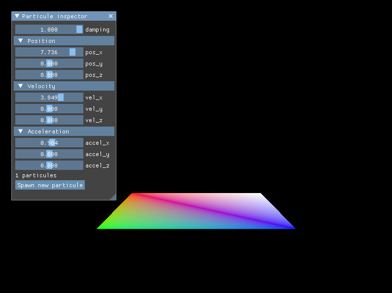
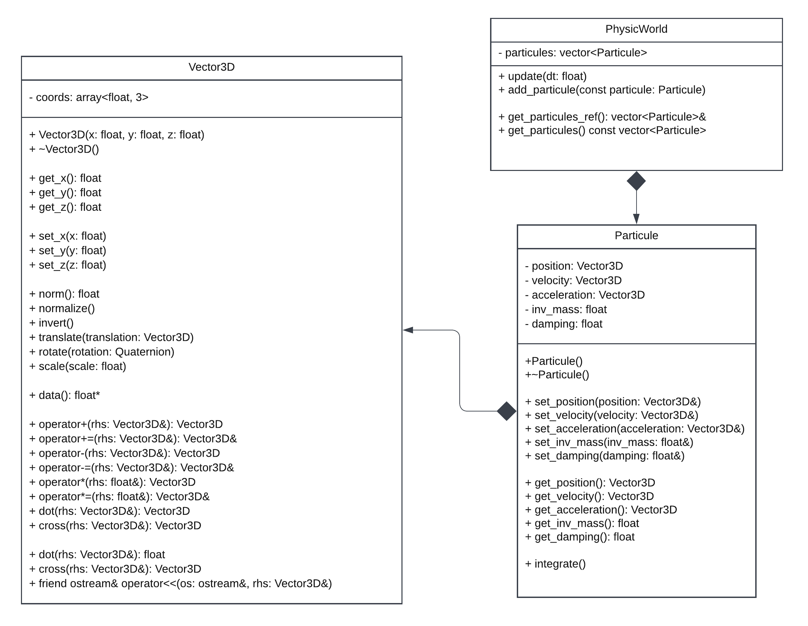

# Projet de session du cours Mathématiques et physique pour le jeu vidéo

Auteurs : Morgan Van Amerongen, Benoit Lorcy, Tom Gibert

## Pré-requis pour compilation sous Windows

- VulkanSDK 1.3.224.1 (https://vulkan.lunarg.com/sdk/home#windows)
- MSYS2 (https://www.msys2.org/) (pour installer mingw)
- MinGW (installation avec MSYS)
  - `pacman -S mingw-w64-x86_64-gcc`
  - `pacman -S mingw-w64-x86_64-cmake`
  - on ajoute `C:\msys64\mingw64\bin` au PATH windows
  - redémarer le PC
- Clone la repository en faisant attention d'inclure les submodules :
  - `git clone --recursive https://github.com/Elzapat/video-game-physics-engine`
  - Ou si la repository est déjà clonée : `git submodule update --init --recursive`

## Compilation

`cmake --build .` en étant dans la racine du projet, pour compiler le projet.

## Phase 2

### Utilisation

* La démo consiste d'une centaine de particule qui ont toutes le même `ParticleAnchoredSpring`, qui est ancré sur `0,0,0`.
* On peut déplacer la caméra dans le monde avec WASD, A, E et la souris.
* Il est possible d'appuyez sur Y pour regagner le controle du curseur et intéragir avec l'UI.
* L'UI permet de modifier le point d'ancrage du `ParticleAnchoredSpring`, ce qui aura pour effet de faire déplacer toutes les particules.
* On peut aussi modifier la longeur de repos du `ParticleAnchoredSpring`, ce qui aura pour effet de plus ou moins éloigner les particules de l'ancrage du ressort.
* Il y a actuallement un bug ou les particules se téléportent parfois, nous n'avons pas encore trouvé la cause et le fix.

Cette démo permet de montrer le (presque) bon fonctionnement des resolutions de contacts et des forces appliqués sur les particules.

## Phase 1

### Utilisation

`.\bin\physics-engine.exe` en étant dans la racine du projet (important pour que le programme puisse trouver les shaders compilés).  
L'interface en haut à droite de l'écran permet de controller le damping, la position, la vélocité et l'accélération d'une particule. Il n'est pas encore possible de faire apparaitre d'autres.

    

### Diagramme de classes

    

