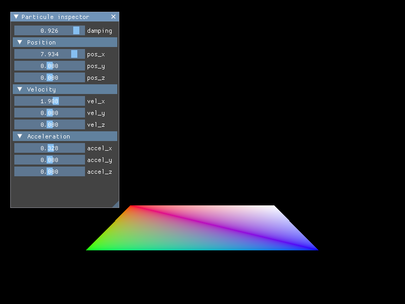

# Projet de session du cours Mathématiques et physique pour le jeu vidéo
Auteurs : Morgan Van Amerongen, Benoit Lorcy, Tom Gibert

## Pré-requis pour compilation sous Windows
* VulkanSDK 1.3.224.1 (https://vulkan.lunarg.com/sdk/home#windows)
* MSYS2 (https://www.msys2.org/) (pour installer mingz)
* MinGW (installation avec MSYS)
    * `pacman -S mingw-w64-x86_64-gcc`
    * `pacman -S mingw-w64-x86_64-cmake`
    * on ajoute `C:\msys64\mingw64\bin` au PATH windows
    * redémarer le PC
* CMake 3 (https://cmake.org/download/)
* Clone la repository en faisant attention d'inclure les submodules :
    * `git clone --recursive https://github.com/Elzapat/video-game-physics-engine`
    * Ou si la repository est déjà clonée : `git submodule update --init --recursive`

## Compilation
`cmake --build .` en étant dans la racine du projet, pour compiler le projet.

## Utilisation
`.\bin\physics-engine.exe` en étant dans la racine du projet (important pour que le programme puisse trouver les shaders compilés).  
L'interface en haut à droite de l'écran permet de controller le damping, la position, la vélocité et l'accélération d'une particule. Il n'est pas encore possible de faire apparaitre d'autres.

    

